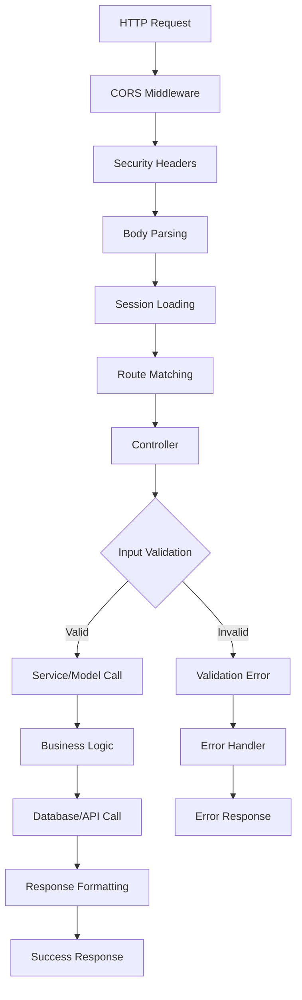

# Backend Codebase Explanation (Extended & Comprehensive)

## Overview: What This Backend Does
This backend is the powerful engine behind the "AI Calorie Tracker" web application. It's a production-ready, TypeScript-based Express API that combines AI with nutrition science.

### Core Capabilities
- **🤖 AI-Powered Nutrition Analysis**: Users describe any food (e.g., "2 slices of pepperoni pizza and a Coke"), and the backend uses OpenAI's GPT to return detailed, structured nutrition data including calories, macros, and individual food breakdowns.
- **🔐 Secure Authentication & Session Management**: Complete user lifecycle with registration, login, logout, and account management. Features secure password hashing (pbkdf2) and Docker-friendly file-based sessions.
- **📊 Personalized Search History**: Authenticated users can view, add, and clear their nutrition analysis history, all persisted in MongoDB with timestamps and summaries.
- **🌐 Anonymous User Support**: Non-registered users can use all nutrition features, with session-based history that doesn't persist.

### Who It's Built For
- **Frontend Developers**: Clean, well-documented REST API with consistent JSON responses
- **DevOps Engineers**: Containerized deployment with health checks, graceful shutdown, and environment-based configuration
- **Backend Developers**: Modern TypeScript codebase with clear separation of concerns, comprehensive testing, and extensible architecture
- **End Users**: Fast, reliable nutrition analysis with optional account features

This backend prioritizes **security**, **extensibility**, and **developer experience** while being robust enough for production workloads.

## Architecture & Project Structure
The backend follows **clean architecture principles** with clear separation of concerns:

```
backend/
├── src/
│   ├── config/          # 🔧 Configuration & Environment
│   │   ├── appConfig.ts     # Central config loader & validator
│   │   ├── database.ts      # MongoDB connection manager
│   │   └── MiddlewareConfig.ts # Express middleware setup
│   ├── controllers/     # 🎮 Request/Response Logic
│   │   ├── NutritionController.ts # AI nutrition analysis
│   │   └── AuthController.ts      # User auth & management
│   ├── services/        # 🏗️ Business Logic & Integrations
│   │   ├── OpenAIService.ts       # AI prompt engineering & parsing
│   │   └── SessionHelper.ts       # Session utilities
│   ├── models/          # 📊 Data Models & Schema
│   │   └── User.ts             # User schema, password hashing, history
│   ├── middleware/      # 🛡️ Cross-cutting Concerns
│   │   └── ErrorHandler.ts    # Global error handling & formatting
│   ├── routes/          # 🛣️ API Route Definitions
│   │   └── apiRoutes.ts        # All endpoint mappings
│   ├── utils/           # 🔧 Helper Functions
│   │   ├── validationSchemas.ts # Joi validation rules
│   │   └── inputSanitizer.ts    # Security input cleaning
│   ├── interfaces/      # 📝 TypeScript Contracts
│   │   └── *.ts               # Type definitions for everything
│   ├── __tests__/       # 🧪 Comprehensive Test Suite
│   │   └── *.test.ts          # Unit & integration tests
│   └── server.ts        # 🚀 Application Entry Point
├── sessions/           # 💾 File-based Session Storage
└── dist/              # 📦 Compiled JavaScript Output
```

### Why This Structure?
- **Scalability**: Each layer has a single responsibility, making it easy to modify or extend individual components
- **Testability**: Clean separation allows for easy unit testing and mocking
- **Maintainability**: New developers can quickly understand where different types of logic live
- **Security**: Validation, sanitization, and error handling are centralized and consistent

## Technology Stack & Design Decisions

### Core Framework & Language
- **🟦 TypeScript + Express**: Provides type safety, excellent IDE support, and rapid development while maintaining the flexibility of Node.js
- **🍃 MongoDB + Mongoose**: Document-based storage perfect for user profiles and flexible search history data

### AI & External Services
- **🤖 OpenAI SDK**: GPT-3.5-turbo for intelligent food analysis with structured JSON responses
- **📊 Custom Prompt Engineering**: Carefully crafted prompts ensure consistent, accurate nutrition data

### Security & Validation
- **🛡️ Helmet**: Security headers (CSP, XSS protection, etc.) with environment-specific configuration
- **✅ Joi**: Schema-based validation for all incoming requests
- **🧹 Custom Input Sanitization**: Prevents injection attacks and ensures data quality
- **🔐 pbkdf2 Password Hashing**: Docker-friendly alternative to bcrypt with equivalent security

### Session Management (Docker-Optimized)
- **📁 express-session + session-file-store**: File-based sessions that persist across container restarts
- **🐳 No Redis Dependency**: Eliminates need for additional infrastructure in containerized deployments
- **⚡ Fast Session Lookup**: File-based storage with configurable TTL and cleanup

### Development & Quality Assurance
- **🧪 Jest + Supertest**: Comprehensive unit and integration testing
- **📏 ESLint**: Code quality and consistency enforcement
- **🔄 Nodemon**: Hot reloading during development
- **📋 TypeScript Strict Mode**: Maximum type safety and error prevention

### Deployment & Operations
- **🐳 Multi-stage Docker**: Optimized production builds with security best practices
- **💚 Health Checks**: Built-in endpoint for container orchestration
- **👤 Non-root User**: Security-hardened container execution
- **🔄 Graceful Shutdown**: Proper cleanup of DB connections and ongoing requests

## Application Lifecycle: From Boot to Request

### 🚀 Startup Sequence
```typescript
// 1. Environment Loading (server.ts)
dotenv.config() // Load .env files with fallback hierarchy

// 2. Configuration Validation (appConfig.ts)
appConfig.validateConfig() // Fail fast if required config missing

// 3. Database Connection (database.ts)
await databaseManager.connect() // MongoDB connection with retry logic

// 4. Express Setup
app.use(MiddlewareConfig.setupMiddleware()) // Security, CORS, sessions, parsing

// 5. Route Registration
app.use('/api', apiRoutes) // Mount all API endpoints

// 6. Error Handling
app.use(ErrorHandler.handle) // Global error catching

// 7. Server Start
server.listen(port) // Begin accepting requests
```

### 🌊 Request Flow Architecture
```
HTTP Request → Middleware Stack → Controller → Service/Model → Response
     ↓              ↓              ↓           ↓           ↓
   CORS,         Validation,    Business     Database    JSON
   Auth,         Sanitization   Logic        Access      Response
   Security      
```

### 🔄 Middleware Pipeline (Every Request)
1. **🔒 Security Headers**: Helmet adds CSP, XSS protection, etc.
2. **🌐 CORS Handling**: Cross-origin request validation
3. **📝 Request Parsing**: JSON/URL-encoded body parsing (10MB limit)
4. **🍪 Session Loading**: File-based session retrieval if exists
5. **📊 Development Logging**: Request/response logging in dev mode

### 🎮 Controller Pattern
Controllers are **thin orchestration layers** that:
- ✅ Validate input using Joi schemas
- 🧹 Sanitize user data for security
- 🏗️ Call appropriate services/models
- 📤 Format and return responses
- ❌ Pass errors to global error handler

### 🏗️ Service Layer
Services contain **pure business logic**:
- 🤖 **OpenAIService**: Prompt engineering, API calls, response parsing
- 🔐 **SessionHelper**: Session manipulation utilities
- 📊 **Future Services**: Payment processing, email, analytics, etc.

### 💾 Data Layer
- **Mongoose Models**: Schema definition, validation, and database operations
- **Pre/Post Hooks**: Password hashing, data transformation
- **Static Methods**: Custom query helpers (e.g., `User.findByUsername()`)
- **Instance Methods**: User-specific operations (e.g., `user.comparePassword()`)

### 🚨 Error Handling Strategy
```typescript
try {
  // Business logic
} catch (error) {
  next(error) // Pass to ErrorHandler.handle()
}
```
- **Development**: Detailed error messages, stack traces
- **Production**: Generic messages, logged details
- **Typed Errors**: Validation, OpenAI, custom application errors

## 🗺️ API Endpoints & Core Functionality

### 🔗 Complete API Reference
```typescript
// Health & Info
GET  /api/health              // System health check
GET  /api/info                // API documentation & version

// 🤖 Nutrition Analysis  
POST /api/calories            // Main food analysis endpoint
GET  /api/nutrition/test      // Test OpenAI connectivity

// 🔐 Authentication
POST /api/auth/register       // Create new user account
POST /api/auth/login          // Authenticate user
POST /api/auth/logout         // End user session
GET  /api/auth/me             // Get current user profile
GET  /api/auth/status         // Check authentication state

// 📊 Search History Management
GET    /api/auth/search-history    // Retrieve user's analysis history
POST   /api/auth/search-history    // Add new search to history
DELETE /api/auth/search-history    // Clear all user history

// 👤 Account Management
DELETE /api/auth/account      // Permanently delete user account
```

### 🤖 Nutrition Analysis Deep Dive
**Endpoint**: `POST /api/calories`

**Input Example**:
```json
{
  "food": "2 slices of pepperoni pizza and a large Coke"
}
```

**Processing Flow**:
1. **Validation**: Joi schema ensures food description exists and is reasonable length
2. **Sanitization**: Remove potentially harmful characters, trim whitespace
3. **AI Prompt Construction**: 
   ```typescript
   const prompt = `Analyze the nutritional content of: "${foodDescription}"
   
   Please provide a JSON response with the following structure:
   {
     "calories": <total calories>,
     "protein": <protein in grams>,
     "carbs": <carbohydrates in grams>,
     "fat": <fat in grams>,
     "fiber": <fiber in grams>,
     "sugar": <sugar in grams>,
     "sodium": <sodium in milligrams>,
     "confidence": <confidence level 0-1>,
     "foodItems": [
       {
         "name": "<food item name>",
         "quantity": "<estimated quantity>",
         "calories": <calories for this item>,
         // ... individual nutrition values
       }
     ]
   }`
   ```
4. **OpenAI API Call**: GPT-3.5-turbo processes the prompt
5. **Response Parsing**: JSON validation and structure verification
6. **Error Handling**: Graceful fallback for malformed AI responses

**Output Example**:
```json
{
  "success": true,
  "data": {
    "calories": 850,
    "protein": 32,
    "carbs": 98,
    "fat": 35,
    "fiber": 4,
    "sugar": 45,
    "sodium": 1800,
    "confidence": 0.85,
    "foodItems": [
      {
        "name": "Pepperoni Pizza",
        "quantity": "2 slices",
        "calories": 560,
        "protein": 24,
        "carbs": 58,
        "fat": 26
      },
      {
        "name": "Coca-Cola",
        "quantity": "20 oz",
        "calories": 240,
        "protein": 0,
        "carbs": 65,
        "fat": 0
      }
    ]
  },
  "timestamp": "2025-01-07T10:30:00.000Z"
}
```

### 🔐 Authentication System Deep Dive

**Session-Based Authentication Flow**:
```typescript
// Registration: POST /api/auth/register
1. Validate input (username, password, nickname)
2. Check if username already exists
3. Hash password using pbkdf2 (salt + 10,000 iterations)
4. Create user in MongoDB
5. Return user profile (password excluded)

// Login: POST /api/auth/login  
1. Validate credentials
2. Look up user by username
3. Compare password using pbkdf2 verification
4. Create session file in /sessions directory
5. Set secure HTTP-only cookie
6. Return user profile + session info

// Session Persistence
- Sessions stored as JSON files: /sessions/{sessionId}.json
- Configurable TTL (default: 24 hours)
- Automatic cleanup of expired sessions
- Works seamlessly in Docker containers
```

**Password Security**:
```typescript
// Hashing (User model pre-save hook)
const salt = crypto.randomBytes(16).toString('hex')
const hash = crypto.pbkdf2Sync(password, salt, 10000, 64, 'sha512')
user.password = `${salt}:${hash}`

// Verification (User instance method)
const [storedSalt, storedHash] = hashedPassword.split(':')
const candidateHash = crypto.pbkdf2Sync(candidatePassword, storedSalt, 10000, 64, 'sha512')
return storedHash === candidateHash
```

### 📊 Search History Management
**Data Structure**:
```typescript
interface SearchHistoryItem {
  searchId: string        // Unique identifier
  query: string          // Original food description
  summary: string        // "Total: 850 calories - Pizza, Coke"
  timestamp: Date        // When analysis was performed
}
```

**Storage Strategy**:
- **Authenticated Users**: Persisted in MongoDB User document
- **Anonymous Users**: Session-based (lost on session end)
- **Automatic Cleanup**: Configurable max history items per user

## 🔄 Data Flow & Request Lifecycle

### Detailed Request Journey


### Real-World Example: Nutrition Analysis Request
```typescript
// 1. Client sends request
POST /api/calories
Content-Type: application/json
Cookie: calorie-tracker.sid=abc123

{
  "food": "chicken breast with rice"
}

// 2. Middleware processing
- CORS: ✅ Allow origin
- Security: ✅ Set headers  
- Parsing: ✅ Extract JSON body
- Session: ✅ Load user session from file

// 3. Controller validation
const { error, value } = validateNutritionRequest(req.body)
const sanitizedFood = sanitizeInput(value.food)

// 4. Service call
const nutritionData = await openAIService.analyzeNutrition(sanitizedFood)

// 5. Response
{
  "success": true,
  "data": { /* nutrition analysis */ },
  "timestamp": "2025-01-07T10:30:00.000Z"
}
```

## 🛡️ Security, Validation & Error Handling

### Multi-Layer Security Strategy
```typescript
// 1. HTTP Security Headers (Helmet)
app.use(helmet({
  contentSecurityPolicy: {
    directives: {
      defaultSrc: ["'self'"],
      styleSrc: ["'self'", "'unsafe-inline'", "https://cdn.jsdelivr.net"],
      scriptSrc: ["'self'", "https://cdn.jsdelivr.net"]
    }
  },
  crossOriginEmbedderPolicy: false, // For OpenAI compatibility
  hsts: { maxAge: 31536000, includeSubDomains: true }
}))

// 2. CORS Configuration
app.use(cors({
  origin: process.env.CORS_ORIGIN?.split(',') || '*',
  credentials: true, // Allow cookies
  methods: ['GET', 'POST', 'PUT', 'DELETE', 'OPTIONS']
}))

// 3. Input Validation (Joi)
const nutritionSchema = Joi.object({
  food: Joi.string()
    .min(1)
    .max(500)
    .required()
    .messages({
      'string.empty': 'Food description is required',
      'string.max': 'Food description too long (max 500 characters)'
    })
})

// 4. Input Sanitization
function sanitizeInput(input: string): string {
  return input
    .trim()
    .replace(/[<>]/g, '') // Remove HTML tags
    .replace(/[\x00-\x1F\x7F]/g, '') // Remove control characters  
    .substring(0, 500) // Enforce length limit
}
```

### Comprehensive Error Handling
```typescript
// Global Error Handler (ErrorHandler.ts)
export class ErrorHandler {
  static handle(err: CustomError, req: Request, res: Response, next: NextFunction) {
    
    // Log error details
    console.error('Application Error:', {
      message: err.message,
      stack: err.stack,
      url: req.url,
      method: req.method,
      timestamp: new Date().toISOString()
    })

    // Determine error type and response
    let errorResponse: ErrorResponse

    if (err.isJoi) {
      // Validation errors
      errorResponse = {
        success: false,
        error: 'Validation failed',
        details: err.details[0].message,
        status: 400
      }
    } else if (err.code?.startsWith('OPENAI_')) {
      // OpenAI API errors
      errorResponse = {
        success: false,
        error: 'AI service temporarily unavailable',
        status: 503
      }
    } else {
      // Generic errors
      errorResponse = {
        success: false,
        error: process.env.NODE_ENV === 'production' 
          ? 'Internal server error' 
          : err.message,
        status: err.status || 500
      }
    }

    res.status(errorResponse.status).json(errorResponse)
  }
}
```

### Session Security
```typescript
// session-file-store configuration
app.use(session({
  secret: process.env.SESSION_SECRET, // Strong random secret
  resave: false,
  saveUninitialized: false, // GDPR compliance
  name: 'calorie-tracker.sid', // Custom session name
  store: new FileStore({
    path: './sessions',
    ttl: 24 * 60 * 60, // 24 hours
    retries: 3,
    logFn: console.log
  }),
  cookie: {
    secure: process.env.NODE_ENV === 'production', // HTTPS only in prod
    httpOnly: true, // Prevent XSS
    maxAge: 24 * 60 * 60 * 1000, // 24 hours
    sameSite: 'lax' // CSRF protection
  }
}))
```

## 🧪 Testing Strategy & Quality Assurance

### Comprehensive Test Coverage
```typescript
// Test Structure
__tests__/
├── AuthController.test.ts      // Authentication flows
├── NutritionController.test.ts // AI nutrition analysis
├── OpenAIService.test.ts       // External API integration
├── User.test.ts                // Database model behavior
├── ErrorHandler.test.ts        // Error handling scenarios
├── validationSchemas.test.ts   // Input validation rules
└── server.test.ts              // Integration tests
```

### Test Examples
```typescript
// Unit Test Example (OpenAIService)
describe('OpenAIService', () => {
  it('should parse valid nutrition response', async () => {
    mockOpenAI.chat.completions.create.mockResolvedValue({
      choices: [{ 
        message: { 
          content: JSON.stringify({
            calories: 300,
            protein: 25,
            carbs: 30,
            fat: 10
          })
        }
      }]
    })

    const result = await openAIService.analyzeNutrition('chicken breast')
    
    expect(result.calories).toBe(300)
    expect(result.protein).toBe(25)
  })

  it('should handle malformed AI responses', async () => {
    mockOpenAI.chat.completions.create.mockResolvedValue({
      choices: [{ message: { content: 'invalid json' } }]
    })

    await expect(
      openAIService.analyzeNutrition('test food')
    ).rejects.toThrow('Failed to parse nutrition analysis response')
  })
})

// Integration Test Example (API endpoints)
describe('Nutrition API', () => {
  it('should analyze food and return nutrition data', async () => {
    const response = await request(app)
      .post('/api/calories')
      .send({ food: 'apple' })
      .expect(200)

    expect(response.body.success).toBe(true)
    expect(response.body.data).toHaveProperty('calories')
    expect(response.body.data).toHaveProperty('protein')
  })
})
```

### Test Commands
```bash
npm run test              # Run all tests
npm run test:watch        # Watch mode for development
npm run test:coverage     # Generate coverage report
npm run test:ci           # CI-optimized test run
```

## 🌍 Environment Configuration & Deployment

### Environment Variables
```bash
# Server Configuration
PORT=3001
NODE_ENV=development
HOST=localhost

# Database
MONGODB_URI=mongodb://localhost:27017/calorietracker

# OpenAI Integration
OPENAI_API_KEY=sk-...
OPENAI_MODEL=gpt-3.5-turbo
OPENAI_MAX_TOKENS=1000
OPENAI_TEMPERATURE=0.3

# Security
SESSION_SECRET=your-super-secret-key-here
CORS_ORIGIN=http://localhost:3000

# Performance
RATE_LIMIT_WINDOW_MS=900000
RATE_LIMIT_MAX_REQUESTS=100
```

### Docker Production Setup
```dockerfile
# Multi-stage build for optimized production image
FROM node:18-alpine AS builder
WORKDIR /app
COPY package*.json ./
RUN npm ci
COPY . .
RUN npm run build

FROM node:18-alpine AS production
WORKDIR /app

# Security: Create non-root user
RUN addgroup -g 1001 -S nodejs
RUN adduser -S nextjs -u 1001

# Install production dependencies only
COPY package*.json ./
RUN npm ci --only=production && npm cache clean --force

# Copy built application
COPY --from=builder --chown=nextjs:nodejs /app/dist ./dist

USER nextjs
EXPOSE 3001

# Health check for container orchestration
HEALTHCHECK --interval=30s --timeout=3s --start-period=5s --retries=3 \
  CMD curl -f http://localhost:3001/api/health || exit 1

CMD ["node", "dist/server.js"]
```

### Container Features
- **🔒 Security**: Non-root user execution
- **💚 Health Checks**: Built-in endpoint for orchestration
- **📁 Persistent Sessions**: File-based storage survives container restarts
- **🔄 Graceful Shutdown**: Proper cleanup on container stop
- **📊 Monitoring**: Structured logging for observability

## 💡 Notable Architecture Decisions & Best Practices

### 🚀 Performance Optimizations
- **Connection Pooling**: MongoDB connection pool (max 10 connections)
- **Request Size Limits**: 10MB body parsing limit prevents DoS
- **Session Cleanup**: Automatic expired session file removal
- **Error Caching**: Structured error responses reduce processing overhead

### 🐳 Docker-First Design
- **No Native Dependencies**: pbkdf2 instead of bcrypt (compilation issues in containers)
- **File-Based Sessions**: No Redis requirement simplifies deployment
- **Multi-Stage Builds**: Smaller production images (only runtime dependencies)
- **Health Checks**: Container orchestration compatibility

### 🔧 Developer Experience
- **Hot Reloading**: Nodemon for rapid development cycles
- **Type Safety**: Strict TypeScript configuration catches errors early
- **Consistent APIs**: All endpoints follow same response format
- **Comprehensive Logging**: Request/response logging in development

### 🎯 AI Integration Best Practices
```typescript
// Robust prompt engineering
const prompt = `Analyze the nutritional content of: "${foodDescription}"

Please provide a JSON response with the following structure:
{
  "calories": <total calories>,
  "protein": <protein in grams>,
  // ... detailed structure
}

For each food item, provide individual nutrition values. Make sure totals 
are the sum of individual items. Be as accurate as possible with nutritional 
estimates. If the description is vague, make reasonable assumptions and 
lower the confidence score accordingly.`

// Response validation
try {
  const nutritionData = JSON.parse(content)
  
  if (typeof nutritionData.calories !== 'number' || 
      typeof nutritionData.protein !== 'number') {
    throw new Error('Invalid nutrition data structure')
  }
  
  return nutritionData
} catch (parseError) {
  throw new Error('Failed to parse nutrition analysis response')
}
```

### 🔄 Graceful Shutdown Pattern
```typescript
// Proper cleanup on termination
const gracefulShutdown = async (signal: string) => {
  console.log(`Received ${signal}. Starting graceful shutdown...`)
  
  server.close(async () => {
    console.log('HTTP server closed')
    
    try {
      await databaseManager.disconnect()
      console.log('Database connection closed')
      process.exit(0)
    } catch (error) {
      console.error('Error during shutdown:', error)
      process.exit(1)
    }
  })
}

process.on('SIGINT', () => gracefulShutdown('SIGINT'))
process.on('SIGTERM', () => gracefulShutdown('SIGTERM'))
```

## 🗂️ Key Files Reference Guide

### 🎯 Start Here (New Developers)
1. **`server.ts`** - Application entry point and setup
2. **`routes/apiRoutes.ts`** - All API endpoints at a glance  
3. **`controllers/`** - Request handling logic
4. **`services/OpenAIService.ts`** - AI integration example

### 🔧 Configuration Files
- **`config/appConfig.ts`** - Environment variable loading & validation
- **`config/database.ts`** - MongoDB connection management
- **`config/MiddlewareConfig.ts`** - Express middleware setup

### 🏗️ Business Logic
- **`controllers/NutritionController.ts`** - Food analysis endpoints
- **`controllers/AuthController.ts`** - User management & sessions
- **`services/OpenAIService.ts`** - AI prompt engineering & parsing
- **`models/User.ts`** - User schema & password handling

### 🛡️ Security & Validation
- **`middleware/ErrorHandler.ts`** - Global error handling
- **`utils/validationSchemas.ts`** - Joi validation rules
- **`utils/inputSanitizer.ts`** - Input cleaning functions

### 📝 Type Definitions
- **`interfaces/`** - TypeScript interfaces for all data structures
- **`interfaces/index.ts`** - Exported type definitions

---

---

# 🚀 Developer Onboarding Guide

## Quick Start Checklist
```bash
# 1. Clone and setup
git clone <repository>
cd backend
npm install

# 2. Environment setup
cp .env.example .env
# Edit .env with your MongoDB URI and OpenAI API key

# 3. Start development
npm run dev

# 4. Verify setup
curl http://localhost:3001/api/health
curl http://localhost:3001/api/nutrition/test
```

## 🎯 Adding New Features

### 1. New API Endpoint
```typescript
// 1. Add route in routes/apiRoutes.ts
router.post('/api/new-feature', (req, res) => {
  newFeatureController.handleRequest(req, res)
})

// 2. Create controller in controllers/NewFeatureController.ts
export class NewFeatureController {
  async handleRequest(req: Request, res: Response): Promise<void> {
    // Validation, business logic, response
  }
}

// 3. Add validation schema in utils/validationSchemas.ts
const newFeatureSchema = Joi.object({
  // Define your validation rules
})

// 4. Write tests in __tests__/NewFeatureController.test.ts
describe('NewFeatureController', () => {
  it('should handle valid requests', async () => {
    // Test implementation
  })
})
```

### 2. New Service Integration
```typescript
// 1. Create service in services/NewService.ts
export class NewService {
  async performOperation(input: string): Promise<Result> {
    // Service logic here
  }
}

// 2. Add to interfaces if needed
interface NewServiceResult {
  // Type definitions
}

// 3. Integrate in controller
const newService = new NewService()
const result = await newService.performOperation(input)
```

## 🔧 Common Development Tasks

### Adding Environment Variables
```typescript
// 1. Add to config/appConfig.ts
this.newFeature = {
  apiKey: process.env.NEW_FEATURE_API_KEY || '',
  endpoint: process.env.NEW_FEATURE_ENDPOINT || 'https://api.example.com'
}

// 2. Add validation if required
if (this.server.environment === 'production' && !this.newFeature.apiKey) {
  throw new Error('NEW_FEATURE_API_KEY is required in production')
}

// 3. Update .env.example
NEW_FEATURE_API_KEY=your_api_key_here
NEW_FEATURE_ENDPOINT=https://api.example.com
```

### Database Schema Changes
```typescript
// 1. Update model in models/
const newFieldSchema = new Schema({
  existingField: String,
  newField: {
    type: String,
    required: true,
    default: 'default_value'
  }
})

// 2. Update TypeScript interfaces
interface INewModel extends Document {
  existingField: string
  newField: string
}

// 3. Add migration logic if needed (in separate migration file)
```

## 🧪 Testing Guidelines

### Writing Good Tests
```typescript
// Test structure
describe('FeatureName', () => {
  beforeEach(() => {
    // Setup mocks and test data
  })

  describe('successful scenarios', () => {
    it('should handle valid input', async () => {
      // Arrange
      const input = { /* test data */ }
      
      // Act
      const result = await feature.process(input)
      
      // Assert
      expect(result.success).toBe(true)
      expect(result.data).toMatchObject({ /* expected structure */ })
    })
  })

  describe('error scenarios', () => {
    it('should handle invalid input gracefully', async () => {
      // Test error cases
    })
  })
})
```

### Mock External Services
```typescript
// Mock OpenAI in tests
jest.mock('../services/OpenAIService')
const mockOpenAIService = OpenAIService as jest.Mocked<typeof OpenAIService>

// Mock database operations
jest.mock('../models/User')
const MockUser = User as jest.MockedClass<typeof User>
```

---

## 📊 System Architecture Summary

This backend represents a **modern, production-ready Node.js API** with the following key strengths:

### 🎯 **Core Philosophy**
- **🔒 Security First**: Multiple layers of protection, secure defaults
- **🧪 Test-Driven**: Comprehensive test coverage for reliability  
- **🐳 Container-Native**: Designed for Docker and cloud deployment
- **🔧 Developer-Friendly**: Clear structure, excellent TypeScript support

### 🏗️ **Technical Excellence**
- **📦 Modular Architecture**: Clean separation of concerns
- **🤖 AI Integration**: Robust OpenAI integration with error handling
- **💾 Flexible Storage**: MongoDB for complex data, file sessions for simplicity
- **🛡️ Production Security**: Helmet, validation, sanitization, secure sessions

### 🚀 **Deployment Ready**
- **📊 Monitoring**: Health checks, structured logging
- **🔄 Reliability**: Graceful shutdown, error recovery
- **📈 Scalable**: Stateless design, database connection pooling
- **🧹 Maintainable**: Comprehensive tests, clear documentation

**Perfect for teams looking to build secure, scalable nutrition/AI applications with a focus on code quality and developer experience.**
